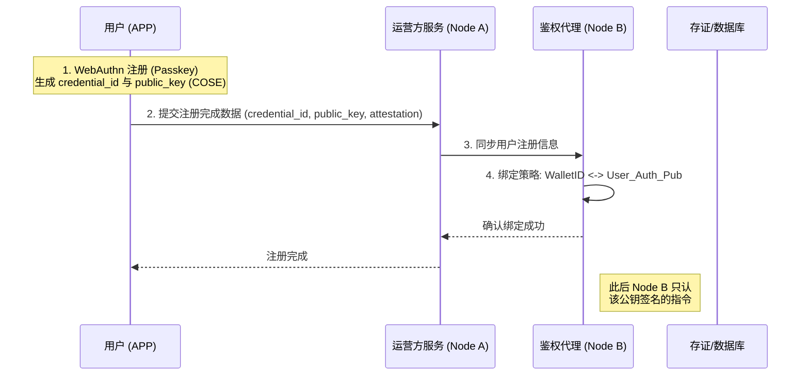
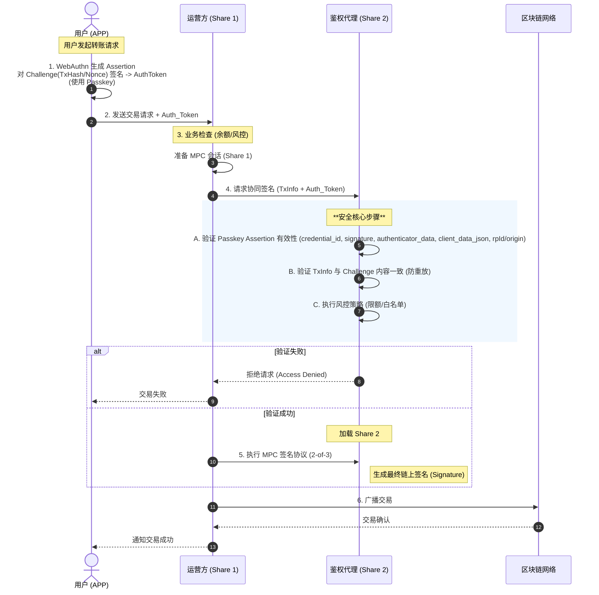
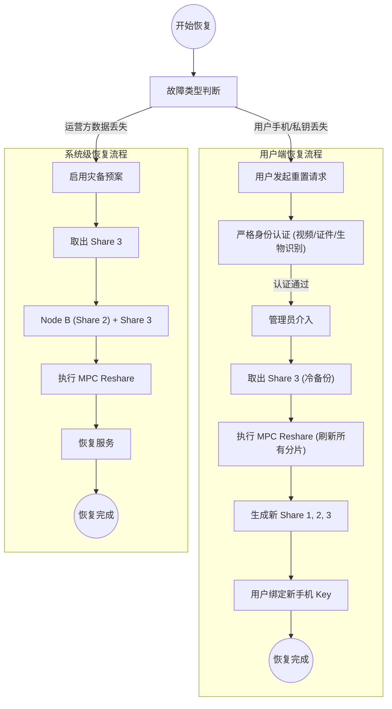
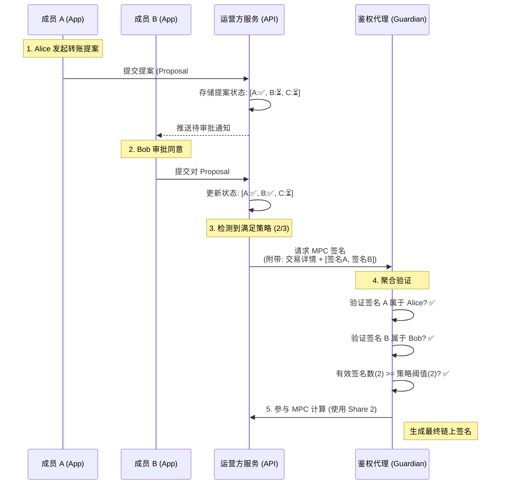

# 2-of-3 分离式鉴权代理 (Delegated Guardian) 方案设计

## 1. 方案概述

本方案旨在解决在 **2-of-3 门限签名** 场景下，用户端（APP）**不具备运行完整 MPC 协议能力**（无法参与 DKG 和 MPC 签名计算），但仍需保证**资金控制权**属于用户，且运营方无法单方挪用资产的问题。当前实现采用 **Passkey (WebAuthn)** 作为用户侧的授权凭证与二次确认机制。

方案的核心思想是引入 **“鉴权代理 (Guardian Node)”** 角色，将用户对资产的控制权转化为“数字签名指令”，由代理节点验证指令后代为执行 MPC 计算。

## 2. 角色与分片架构

系统采用 `2-of-3` 门限方案，至少需要 2 个分片参与才能完成签名。分片分配如下：

| 分片编号 | 持有者 | 部署位置 | 角色性质 | 关键职责 |
| :--- | :--- | :--- | :--- | :--- |
| **Share 1** | **运营方 (Operator)** | 运营方服务器 (云端 A) | 业务发起方 | 负责构建交易、发起 MPC 会话、持有业务分片。即使被攻破，攻击者仅获得 1/3 控制权。 |
| **Share 2** | **鉴权代理 (Guardian)** | 独立安全环境 (云端 B / TEE) | **用户代理人** | **方案核心**。不处理具体业务逻辑，**只验证用户指令**。只有在验证通过后，才加载 Share 2 参与计算。 |
| **Share 3** | **冷备份 (Cold Backup)** | 离线存储 / 银行保管箱 | 灾难恢复 | 平时不在线。仅在 Share 1 或 Share 2 丢失/损坏时取出用于重置系统。 |

## 3. 核心流程设计

### 3.1 注册绑定流程 (Setup)

用户首次使用时，通过 **WebAuthn 注册** 生成 Passkey，并将 `credential_id` 与 `public_key (COSE)` 绑定到鉴权代理策略。

### 3.2 交易签名流程 (Transaction Signing)

这是日常转账的核心流程。用户在本地设备上完成 **WebAuthn Assertion** 轻量签名，复杂的 MPC 计算在云端完成。

### 3.3 灾难恢复流程 (Recovery)

当用户丢失手机（丢失 `User_Auth_Key`）或运营方服务器故障时的恢复机制。

## 4. 安全性分析

### 4.1 为什么运营方无法作恶？
虽然运营方持有 **Share 1** 并可能拥有 **Node B** 的基础设施权限，但我们通过以下层级保证安全：

1.  **协议层隔离**：Node B 的代码逻辑强制要求 `Auth_Token`。没有用户私钥生成的签名，程序逻辑走不通。
2.  **基础设施隔离**：
    *   建议 Node A 和 Node B 部署在不同的云服务商或不同的 Kubernetes 集群。
    *   权限分离，Node A 的管理员无法登录 Node B。
3.  **可信执行环境 (TEE) 增强 (推荐)**：
    *   将 Node B 部署在 Intel SGX / AWS Nitro Enclaves 中。
    *   **效果**：即使拥有服务器 Root 权限，也无法读取内存中的 Share 2，也无法篡改验证代码逻辑。

### 4.2 为什么用户端是安全的？
*   **私钥不离身**：Passkey 私钥由设备安全硬件（Secure Enclave/KeyStore）托管，仅用于生成 WebAuthn Assertion，不参与复杂 MPC 交互。
*   **所见即所签**：APP 展示交易详情，Challenge 绑定交易 Hash/Nonce/时间窗，结合 WebAuthn 的 `origin` 校验，防重放与跨域伪造。

## 5. 扩展方案：团队多签 (Team Multisig)

在 Delegated Guardian 架构下实现团队多签（如 2-of-3 人员审批），**不需要**部署链上多签合约，也**不需要**改变底层的 MPC 门限（保持 2-of-3 分片）。核心逻辑是升级 Guardian 的验证策略：收集 **N 个 Passkey Assertion** 满足阈值后再参与 MPC。

### 5.1 核心理念：链下策略聚合
*   **原个人模式**：Guardian 见 **1** 个有效 Passkey Assertion 即放行 Share 2。
*   **新团队模式**：Guardian 见齐 **N** 个有效团队成员的 Passkey Assertion 才放行 Share 2。

### 5.2 流程设计

假设场景：3人团队 (Alice, Bob, Carol)，需 2 人同意才能转账。

### 5.3 方案优势
1.  **零 Gas 成本**：多人审批逻辑完全在链下完成，链上只发生一笔普通转账。
2.  **隐私保护**：链上无法通过分析交易追溯团队结构或审批人信息。
3.  **灵活配置**：随时调整审批规则（如换人、改阈值），无需迁移资产或重新部署合约。

## 6. 方案优缺点总结

| 维度 | 优势 | 劣势/挑战 |
| :--- | :--- | :--- |
| **用户体验** | **极佳**。用户无感知 MPC 复杂性，操作习惯与传统钱包一致（指纹/FaceID 确认）。 | 需要依赖网络，无离线签名能力。 |
| **兼容性** | **完美**。产出标准 EOA 签名，支持所有 EVM 链及 BTC 等异构链，无需智能合约支持。 | 无。 |
| **安全性** | **高**。实现了“不信任单一运营方”，攻击成本需同时攻破用户端和代理节点。 | 依赖 Node B 的代码完整性和执行环境安全 (建议上 TEE)。 |
| **成本** | **低**。链上 Gas 费与普通转账一致（无多签合约开销）。 | 需维护两套独立的节点设施 (Node A & Node B)。 |
