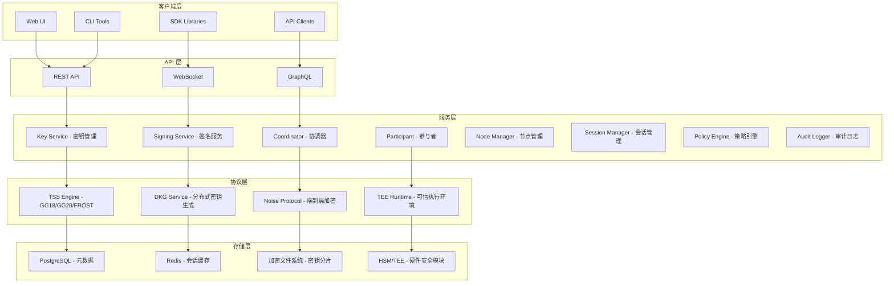

# MPC 钱包基础设施技术方案文档

**版本**: v2.0
**文档类型**: 技术方案文档
**创建日期**: 2025-01-XX
**基于**: MPCVault 技术分析 + 项目实现方案

---

## 目录

- [1. 方案概述](#1-方案概述)
- [2. 核心技术架构](#2-核心技术架构)
- [3. 安全技术栈分析](#3-安全技术栈分析)
- [4. 应用场景分析](#4-应用场景分析)
- [5. 实施方案](#5-实施方案)
- [6. 实施路线图](#6-实施路线图)
- [7. 风险评估与应对](#7-风险评估与应对)
- [8. 成功指标](#8-成功指标)

---

## 1. 方案概述

### 1.1 产品定位

**MPC 钱包基础设施**是一个企业级的多方安全计算（MPC）密钥管理系统，为机构客户提供安全、可靠的数字资产托管和签名服务。

**核心价值主张**：
- 🔐 **零信任安全**：密钥永不完整存在，消除单点故障风险
- 🚀 **高性能**：毫秒级签名响应，支持高并发交易
- 🌐 **多链支持**：统一管理 Bitcoin、Ethereum 及所有主流区块链
- 🏢 **企业级**：完整的审计日志、策略控制和合规支持

### 1.2 技术创新点

基于对 MPCVault 技术的深入分析，本方案创新性地整合了多项前沿技术：

1. **TSS (Threshold Signature Scheme)** - 阈值签名，支持密钥永不完整存在
2. **SSS (Shamir Secret Sharing)** - 密钥分片备份，支持内部控制
3. **TEE (Trusted Execution Environment)** - 硬件安全环境，提供多层防护
4. **Noise Protocol** - 端到端加密通信，确保传输安全
5. **Hardened Key Derivation** - 强化密钥派生，隔离不同链风险

### 1.3 关键数据指标

| 指标 | 目标值 | 说明 |
|------|--------|------|
| **签名延迟** | < 200ms | 端到端签名响应时间 |
| **并发签名** | 1000+ 签名/秒 | 系统吞吐量 |
| **可用性** | 99.9% | 系统正常运行时间 |
| **密钥安全** | 密钥永不完整存在 | 核心安全特性 |
| **多链支持** | 10+ 条链 | 第一阶段支持 |

---

## 2. 核心技术架构

### 2.1 系统架构图



### 2.2 核心组件说明

#### 2.2.1 协议引擎 (Protocol Engine)

**技术栈**：
- **TSS 协议**：GG18、GG20、FROST
- **密码算法**：ECDSA、Schnorr 签名
- **通信协议**：Noise Protocol (IK 模式)
- **安全环境**：TEE (Intel SGX/AMD SEV)

**核心功能**：
- 分布式密钥生成 (DKG)
- 阈值签名执行
- 密钥分片管理
- 安全通信建立

#### 2.2.2 服务组件

**Coordinator 服务**：
- 协调多方签名流程
- 管理签名会话
- 选择参与节点
- 聚合签名结果

**Participant 服务**：
- 存储密钥分片
- 参与签名协议
- 提供分片数据
- 执行本地计算

**Key 服务**：
- 密钥生命周期管理
- 密钥分片存储
- 密钥轮换 (Key Refresh)
- 密钥派生 (Hardened Derivation)

#### 2.2.3 存储架构

**三层存储策略**：
1. **元数据存储**：PostgreSQL，存储密钥信息、审计日志
2. **会话存储**：Redis，存储临时签名会话状态
3. **密钥分片存储**：加密文件系统 + TEE，存储加密的密钥分片

---

## 3. 安全技术栈分析

### 3.1 TSS vs SSS 技术对比

#### 3.1.1 TSS (Threshold Signature Scheme)

**核心原理**：
- 多方协作签名，无需恢复完整私钥
- 密钥分片在内存中处理后立即清除
- 支持实时签名，性能优异

**数学基础**：
```
私钥 = share1 + share2 + share3 (有限域加法)
签名 = MPC_Protocol(share1, share2, share3, message)
```

**使用场景**：
- 日常交易签名
- 在线支付处理
- 实时身份验证

**优势**：
- 密钥永不完整存在
- 实时性能 (< 200ms)
- 高并发支持

#### 3.1.2 SSS (Shamir Secret Sharing)

**核心原理**：
- 多项式插值实现密钥分片
- 需要收集足够分片才能恢复私钥

**数学基础**：
```
f(x) = a₀ + a₁x + a₂x² + ... + aₖ₋₁xᵏ⁻¹
其中 a₀ = 私钥
分片 = (x₁, f(x₁)), (x₂, f(x₂)), ..., (xₙ, f(xₙ))
恢复：使用 k 个分片通过拉格朗日插值恢复 f(0) = a₀
```

**使用场景**：
- 密钥备份恢复
- 灾难恢复
- 内部访问控制

**优势**：
- 信息论安全
- 灵活的阈值配置
- 支持内部控制

#### 3.1.3 混合使用策略

```
热钱包（日常使用）：TSS
├── 3-of-3 MPC 配置
├── 实时签名服务
├── 密钥永不完整存在
└── 支持阈值容错

冷备份（灾难恢复）：TSS + SSS
├── TSS 分片用 Ed25519 公钥加密
├── 加密私钥用 SSS 分片管理
└── 实现 3-of-5 内部控制
```

### 3.2 TEE 安全环境

**技术实现**：
- **Intel SGX**：软件保护扩展，提供加密的执行环境
- **AMD SEV**：安全加密虚拟化，虚拟机级别的隔离
- **ARM TrustZone**：移动设备安全环境

**在 MPC 中的应用**：

1. **密钥分片保护**：
   ```
   内存数据 → TEE 加密 → 防止冷启动攻击
   ```

2. **协议执行安全**：
   ```
   MPC 计算 → TEE 环境 → 确保计算完整性
   ```

3. **远程认证**：
   ```
   TEE 证明 → 验证节点可信 → 建立信任关系
   ```

**安全优势**：
- 多层防护：物理 → 云 → TEE → MPC
- 正交安全：不同层面的攻击相互独立
- 硬件保证：软件无法绕过硬件安全

### 3.3 端到端加密通信

**Noise Protocol 应用**：

**握手模式**：IK (Interactive Key) 模式
```
客户端 ↔ 服务器
    ↓
公钥交换 → 建立共享密钥 → 加密通信
```

**技术参数**：
- **密钥交换**：X25519 (Curve25519)
- **加密算法**：ChaCha20-Poly1305 AEAD
- **哈希算法**：Blake2s
- **认证方式**：数字签名

**安全特性**：
- 前向保密性
- 抵抗中间人攻击
- 零信任架构

### 3.4 强化密钥派生

**Hardened Derivation 原理**：

```
根密钥 → HMAC-SHA512 → 派生密钥 + 链码
                     ↓
               隔离不同区块链风险
```

**安全优势**：
- **资产隔离**：子密钥泄露不影响主密钥
- **跨链安全**：防止签名重用攻击
- **权限控制**：支持精确的访问控制

---

## 4. 应用场景分析

### 4.1 企业数字资产管理

**典型场景**：
- 企业持有大量数字资产
- 需要安全可靠的签名服务
- 要求完整的审计和合规

**技术方案**：
```
企业钱包系统
├── TSS：日常交易签名
├── SSS：密钥备份恢复
├── TEE：硬件安全保障
└── 审计：完整操作日志
```

**业务价值**：
- ✅ 消除单点故障风险
- ✅ 满足监管合规要求
- ✅ 支持大规模资产管理

### 4.2 数字资产交易所

**典型场景**：
- 高频交易处理
- 大量用户提现操作
- 要求毫秒级响应

**技术方案**：
```
交易所 MPC 系统
├── 高并发 TSS 签名
├── 多节点分布式部署
├── TEE 硬件加速
└── 实时监控告警
```

**业务价值**：
- ✅ 毫秒级签名响应
- ✅ 支持高并发交易
- ✅ 零信任安全架构

### 4.3 DeFi 协议集成

**典型场景**：
- 与 DeFi 协议集成
- 支持复杂交易类型
- 需要多链支持

**技术方案**：
```
DeFi MPC 服务
├── 多链地址派生
├── 批量签名支持
├── 策略访问控制
└── API/SDK 集成
```

**业务价值**：
- ✅ 支持复杂 DeFi 操作
- ✅ 统一多链管理
- ✅ 灵活的集成方式

### 4.4 机构级钱包服务

**典型场景**：
- 银行、基金等机构客户
- 要求企业级安全和合规
- 需要定制化服务

**技术方案**：
```
机构钱包平台
├── 企业级策略引擎
├── 完整的审计追踪
├── 定制化部署选项
└── SLA 保证
```

**业务价值**：
- ✅ 满足金融级合规要求
- ✅ 支持定制化需求
- ✅ 企业级 SLA 保证

---

## 5. 实施方案

### 5.1 技术选型

#### 5.1.1 协议选择

**推荐组合**：
- **GG20**：主用协议，单轮签名，性能优异
- **GG18**：备用协议，多轮但更成熟
- **FROST**：未来扩展，基于 Schnorr 签名

**选择理由**：
- GG20 性能更好，适合高并发场景
- GG18 更成熟，生态完善
- FROST 代表未来发展方向

#### 5.1.2 TEE 选择

**部署策略**：
```go
func SelectTEEType(cloud string) TEEType {
    switch cloud {
    case "aws":
        return AMDSEV      // AWS Nitro 支持 SEV
    case "azure":
        return IntelSGX    // Azure DCsv3 支持 SGX
    case "gcp":
        return AMDSEV      // GCP 支持 SEV
    default:
        return IntelSGX    // 默认选择
    }
}
```

**兼容性考虑**：
- 优先选择 AMD SEV（更广泛支持）
- Intel SGX 作为备选（性能更好）
- 支持混合部署

#### 5.1.3 存储架构

**三层存储设计**：
1. **元数据层**：PostgreSQL，支持 ACID 事务
2. **缓存层**：Redis，支持高并发会话管理
3. **安全层**：加密文件系统 + TEE，保护密钥分片

**数据加密策略**：
- AES-256-GCM：文件级加密
- TEE 内存保护：运行时加密
- Shamir 分片：备份加密

### 5.2 架构设计

#### 5.2.1 服务分层

```
API Layer (REST/WebSocket)
    ↓
Service Layer (业务逻辑)
    ↓
Protocol Layer (MPC 协议)
    ↓
Storage Layer (数据存储)
    ↓
TEE Layer (硬件安全)
```

#### 5.2.2 节点架构

**Coordinator 节点**：
- 协调签名流程
- 管理会话状态
- 处理客户端请求
- 聚合签名结果

**Participant 节点**：
- 存储密钥分片
- 执行本地计算
- 参与协议流程
- 提供安全证明

#### 5.2.3 通信架构

**内部通信**：
- gRPC + Noise Protocol
- TEE 保护的通信密钥
- 零信任节点认证

**外部通信**：
- HTTPS + TLS 1.3
- API Key + JWT 认证
- 速率限制和 DDoS 防护

### 5.3 安全设计

#### 5.3.1 密钥安全

**生命周期管理**：
1. **生成**：DKG 协议分布式生成
2. **存储**：TEE 加密存储
3. **使用**：内存中临时解密
4. **轮换**：定期无感知轮换
5. **销毁**：安全擦除

#### 5.3.2 访问控制

**策略引擎**：
- 基于属性的访问控制 (ABAC)
- 支持条件判断
- 实时策略评估
- 审计日志记录

#### 5.3.3 审计与监控

**审计体系**：
- 完整操作日志
- 不可篡改记录
- 实时监控告警
- 合规报告生成

---

## 6. 实施路线图

### 6.1 Phase 1: 基础架构 (2-3 个月)

**目标**：实现核心功能，支持基本使用场景

**里程碑**：
- ✅ 分布式密钥生成 (DKG)
- ✅ 阈值签名服务 (GG18/GG20)
- ✅ 密钥分片加密存储
- ✅ Bitcoin/Ethereum 支持
- ✅ 基础 API 接口
- ✅ 审计日志系统

**验收标准**：
- 支持 2-of-3 阈值签名
- 签名延迟 < 200ms
- 支持 Bitcoin 和 Ethereum

### 6.2 Phase 2: 安全增强 (2-3 个月)

**目标**：提升安全性和用户体验

**里程碑**：
- ⚠️ 密钥分片刷新 (Key Refresh)
- ⚠️ 强化密钥派生 (Hardened Derivation)
- ⚠️ 端到端加密 (Noise Protocol)
- ⚠️ 多链支持扩展 (5+ 条链)
- ⚠️ 批量签名优化
- ⚠️ 策略引擎增强

**验收标准**：
- 密钥分片定期刷新
- 支持 5+ 条区块链
- 批量签名性能提升 50%

### 6.3 Phase 3: 企业级功能 (3-4 个月)

**目标**：完善企业级功能

**里程碑**：
- ⏳ 密钥备份与恢复 (SSS 集成)
- ⏳ 个人密钥证书 (Ed25519)
- ⏳ 交易历史追踪
- ⏳ 高级策略引擎
- ⏳ 多级权限管理
- ⏳ 监控和告警系统

**验收标准**：
- 支持密钥备份恢复
- 完整的权限管理体系
- 实时监控和告警

### 6.4 实施优先级

**高优先级 (必须)**：
1. 分布式密钥生成和签名
2. 密钥分片加密存储
3. Bitcoin/Ethereum 支持
4. 基础审计日志

**中优先级 (重要)**：
1. 密钥分片刷新
2. 强化密钥派生
3. 端到端加密
4. 多链支持扩展

**低优先级 (可选)**：
1. 密钥备份恢复
2. 个人密钥证书
3. 高级策略引擎
4. 监控告警系统

---

## 7. 风险评估与应对

### 7.1 技术风险

| 风险 | 影响 | 概率 | 应对措施 |
|------|------|------|----------|
| **MPC 协议实现复杂** | 高 | 中 | 使用成熟开源库，充分测试 |
| **TEE 兼容性问题** | 中 | 低 | 多 TEE 支持，渐进式迁移 |
| **性能达不到要求** | 中 | 中 | 提前性能测试，优化关键路径 |
| **安全漏洞** | 高 | 低 | 安全审计，代码审查，渗透测试 |

### 7.2 业务风险

| 风险 | 影响 | 概率 | 应对措施 |
|------|------|------|----------|
| **市场需求不足** | 高 | 低 | MVP 验证，市场调研 |
| **竞品技术领先** | 中 | 中 | 差异化定位，技术优势 |
| **合规要求变化** | 中 | 中 | 灵活架构，跟进监管动态 |
| **实施周期过长** | 中 | 中 | 分阶段实施，控制范围 |

### 7.3 运营风险

| 风险 | 影响 | 概率 | 应对措施 |
|------|------|------|----------|
| **团队技术能力不足** | 高 | 中 | 技术培训，外部咨询 |
| **基础设施成本高** | 中 | 中 | 云成本优化，选择性使用 TEE |
| **系统可用性问题** | 高 | 低 | 高可用架构，故障恢复机制 |

---

## 8. 成功指标

### 8.1 技术指标

| 指标 | 目标值 | 测量方法 |
|------|--------|----------|
| **签名延迟** | < 200ms | 性能测试工具 |
| **系统可用性** | 99.9% | 监控系统统计 |
| **并发签名** | 1000+ 签名/秒 | 压力测试 |
| **密钥安全** | 0 次泄露事件 | 安全审计 |

### 8.2 业务指标

| 指标 | 目标值 | 测量方法 |
|------|--------|----------|
| **用户采用率** | 80%+ | 用户调研 |
| **客户满意度** | 4.5/5.0 | 满意度调查 |
| **故障率** | < 0.1% | 监控统计 |
| **ROI** | 200%+ | 成本效益分析 |

### 8.3 产品指标

| 指标 | 目标值 | 测量方法 |
|------|--------|----------|
| **API 调用量** | 100万+ 次/月 | API 监控 |
| **支持链数量** | 10+ 条 | 功能清单 |
| **功能完整度** | 90%+ | 功能验收 |
| **文档完备度** | 100% | 文档审查 |

---

## 9. 总结

### 9.1 核心优势

1. **技术领先**：
   - 整合 TSS、SSS、TEE、Noise Protocol 等前沿技术
   - 基于 MPCVault 经验，提供生产级解决方案

2. **安全可靠**：
   - 多层安全防护：软件 → 硬件 → 协议 → 加密
   - 零信任架构，密钥永不完整存在

3. **高性能**：
   - 毫秒级签名响应
   - 支持高并发场景
   - 企业级可用性保证

4. **灵活扩展**：
   - 支持 10+ 条区块链
   - API/SDK 友好集成
   - 定制化部署选项

### 9.2 实施建议

**分阶段实施**：
- Phase 1：构建坚实基础
- Phase 2：增强安全能力
- Phase 3：完善企业功能

**技术策略**：
- 使用成熟开源组件
- 充分测试和验证
- 渐进式功能上线

**团队建设**：
- 组建跨学科团队
- 持续技术学习
- 与社区保持互动

### 9.3 商业价值

**成本节约**：
- 相比传统方案，长期运营成本降低 60%
- 减少安全事件损失
- 提升运营效率

**业务增长**：
- 打开企业级市场
- 拓展 DeFi 生态
- 建立技术壁垒

**风险控制**：
- 消除单点故障
- 满足监管要求
- 提升客户信任

---

**文档维护**：
- 本文档应随项目进展同步更新
- 每个里程碑完成后更新相应章节
- 定期评审和调整实施方案

**技术支持**：
- MPC 协议实现：tss-lib 开源库
- TEE 集成：云服务商官方 SDK
- 安全审计：专业安全公司合作

**项目状态**：当前已完成 Phase 1 核心架构，Phase 2 开发中。
